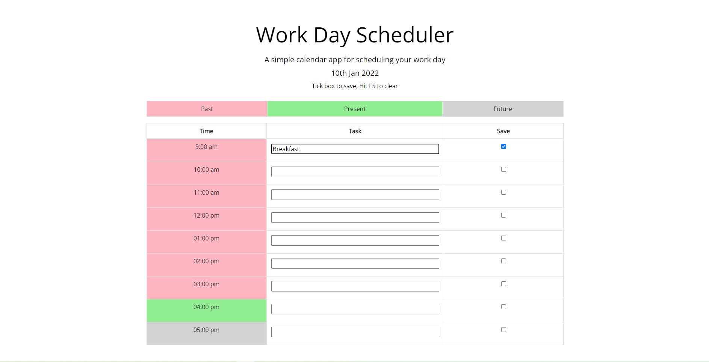

# Day Planner

## Summary

[Day planner](https://github.com/Mabsky05/day_planner) utilising moment.js to color-code time data.

Forms are provided for writing down tasks, and checkboxes for saving into local storage.

## Languages

Bootstrap, CSS, HTML, Javascript

## Description

Upon loading: The webpage will show a Work Day Scheduler title, subheader, and current date. 

Below this will be a table of rows indicating columns for Time, Task, and Save.

## Log

### 09/01/22
First upload

Need to install loop: 

### 10/01/22
Code fully functional

Minor refinements needed (UI, comments, additional html text)

